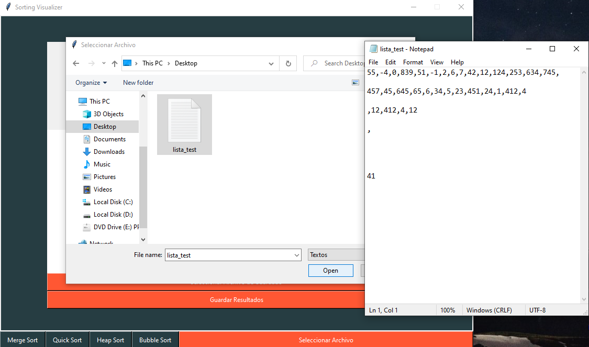
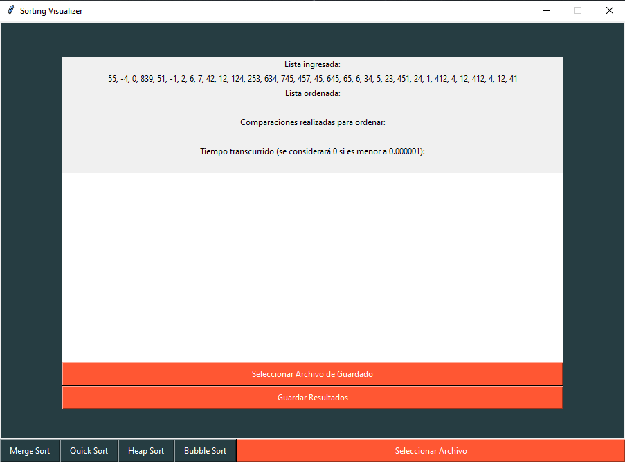
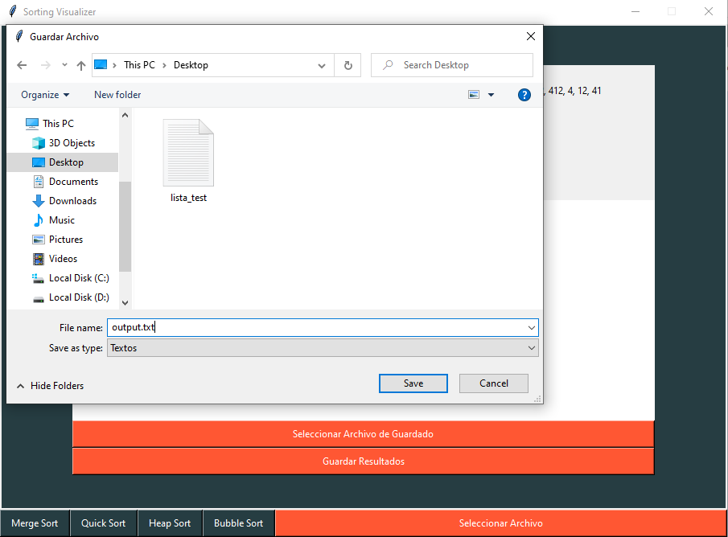
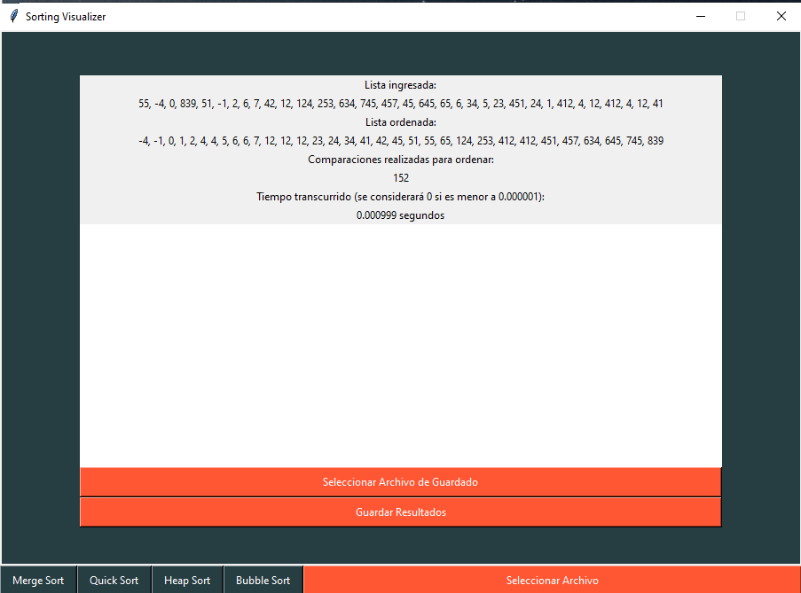
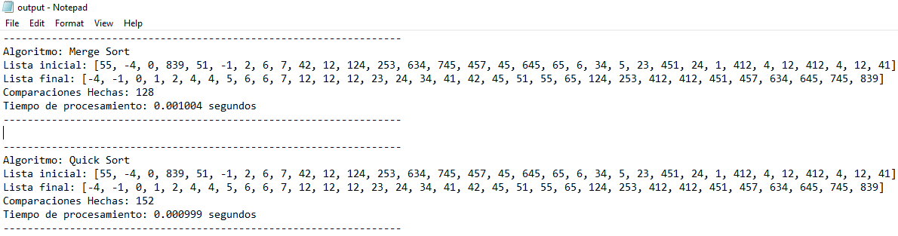

# Descripción:
Proyecto personal que permite visualizar las diferencias de 4 algoritmos de ordenamiento en cuanto a tiempo de procesamiento y cantidad de comparaciones que realizan para obtener el mismo resultado. 

- Desarrollado en **Python**. 
- Se utilizó **Tkinter** para la interfaz gráfica.
- Se utilizó **unittest** para el desarrollo de test unitarios.

Algoritmos implicados: 
- Merge Sort
- Heap Sort
- Quick Sort
- Bubble Sort

# Uso:
1. Ejecutar app.py.
2. Seleccionar un .txt con la lista a ordenar.
3. Seleccionar el/los algoritmo/s a aplicar.
4. Guardar los datos en un .txt de salida.

El programa requiere de un .txt que contenga números enteros separados por ','. Cualquier otro caracter será considerado como no válido y la lista será rechazada. La lista no necesariamente debe estar ordenada en una única línea sino que, como se ve en el .txt de ejemplo que se encuentra en este repositorio bajo el nombre de lista_test.txt, la única condición es que cada número esté separado por una ','.

Luego el mismo programa pedirá seleccionar o crear un .txt de salida con el nombre que el usuario especifique si se quiere guardar los resultados obtenidos. Esto no es necesario ya que se pueden visualizar los resultados en la pantalla del programa. Sin embargo, el espacio para visualizar la lista ordenada es limitado y en caso de tener una lista extensa, esta deberá ser impresa en el .txt de salida para observarla.

# Imágenes del funcionamiento:

